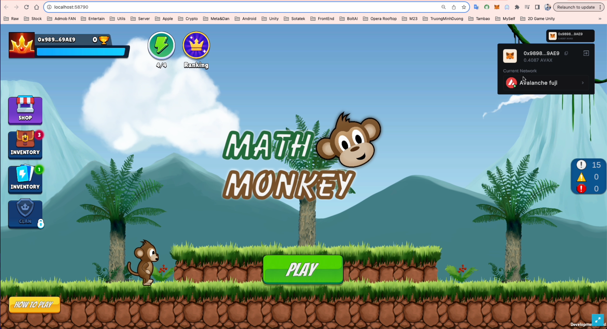
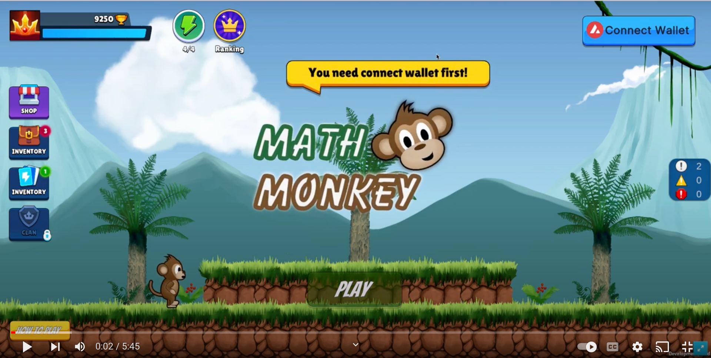
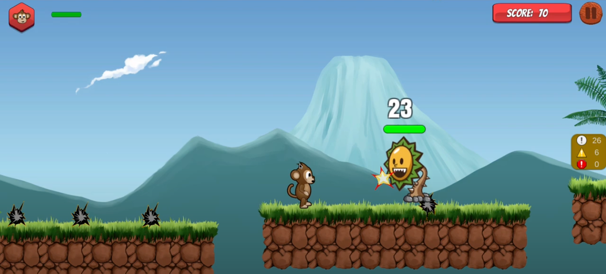

# Unity-MathGame-Avalanche-Web3-Hackathon
###  Sotatek x Avalanche : HACKATHON 2023

## ⚙️ What is Math Game Ecosystem

The idea is to bring a game product that is both entertaining, educational, rewarding, motivating, and integrating new technologies, giving users easy access to web3, with Blockchain technology.

## 🔬 Feautures

1. Educational entertainment:
- The project is a system of mathematical-related games.
- Help users experience computing, logical thinking, reflection training.
- Improve computing, mind sensitivity through beautiful, intriguing games.

2. Ranking system, rewards:
- Top rankings of players with the highest score
- The score is based on the player's strength.
- Distribution of token rewards by time and ranking.

3. Blockchain base deployment - Avalanche:
- Data storage on Avalanche chain.
- Cheap transaction cost = 1/10 on ETH 
- Fast transaction processing speed 
- Easy integration.

## Gameplay : 
Demo Game Play : 

## 💰 Futures : 
- Combine ads (view video bonus, add network, banner...) or receive ads in the game to optimize the source of revenue.
- Integrate other thinking training games, not just mathematics, but also language, letters, logic, IQ, etc.
- Organizing competitions, betting between players, other mini-games.
- Burn tokens to promote value.

## 💰 Documents / Assets :

See [my portfolio](https://github.com/bienpx224) for more details

## ⚡️ Tech-Stack

- Unity
- Solidity
- Avalanche network
- Truffle / Ganache
- OpenZeppelin
- Metamask (web3)
- Thirdweb SDK
- Infura

## 💰 Support this project for my team. Thanks 
