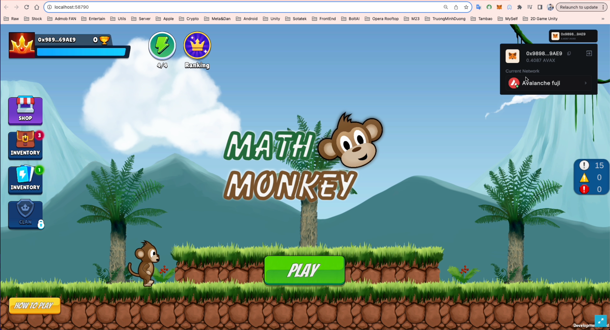
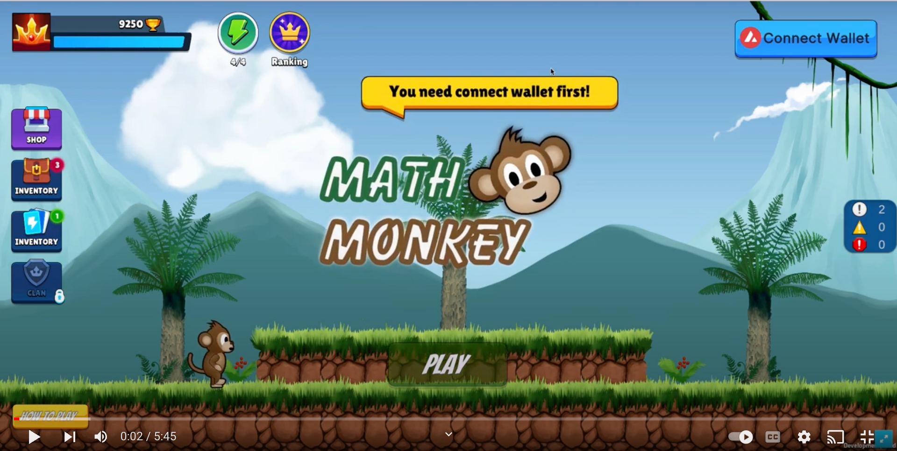
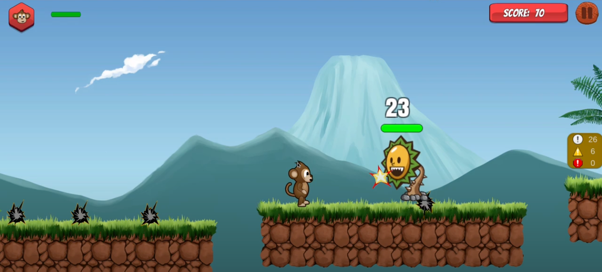

# Unity-MathGame-Avalanche-Web3-Hackathon
###  Sotatek x Avalanche : HACKATHON 2023

## ⚙️ What is Math Game Ecosystem

The idea is to bring a game product that is both entertaining, educational, rewarding, motivating, and integrating new technologies, giving users easy access to web3, with Blockchain technology.

## 🔬 Feautures

1. Game mang tính giải trí - giáo dục  :
- Dự án là Hệ thống các game liên quan đến toán học.
- Giúp người dùng trải nghiệm tính toán, tư duy logic, rèn luyện phản xạ. 
- Cải thiện được khả năng tính toán, sự nhạy bén của trí óc thông qua các tựa game đẹp mắt, cuốn hút. 

2. Hệ thống xếp hạng, phần thưởng : 
- Bảng xếp hạng Top các người chơi có điểm số cao nhất 
- Cách tính điểm số dựa vào thực lực người chơi. 
- Phân bố phần thưởng token theo thời gian và ranking. 

3. Triển khai trên nền tảng Blockchain - Avalanche : 
- Lưu trữ dữ liệu on chain Avalanche. 
- Chi phí giao dịch rẻ = 1/10 trên ETH
- Tốc độ xử lý giao dịch nhanh 
- Dễ dàng tích hợp.

## Gameplay : 
Demo Game Play : 

## 💰 Futures : 
- Kết hợp quảng cáo (Xem video nhận thưởng, thêm mạng, banner..) hoặc nhận đặt quảng cáo trong game để tối ưu nguồn thu lợi nhuận. 
- Tích hợp thêm các game giáo dục rèn luyện tư duy khác, không chỉ đơn thuần về Toán học mà còn có thể về ngôn ngữ, chữ cái, logic, IQ,..
- Tổ chức các cuộc thi, đặt cược giữa các người chơi, mini game khác. 
- Thực hiện burn token thu được nhằm thúc đẩy giá trị. 

## 💰 Documents / Assets :

See [my portfolio](https://github.com/bienpx224) for more details

## ⚡️ Tech-Stack

- Unity
- Solidity
- Avalanche network
- Truffle / Ganache
- OpenZeppelin
- Metamask (web3)
- Thirdweb SDK
- Infura

## 💰 Support this project for my team. Thanks 
